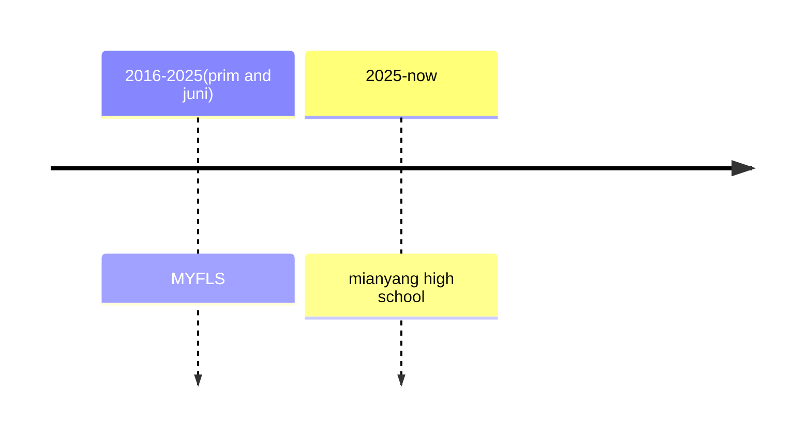

# 👋 Hello, I'm Ceaser Zhao, a high school developer from china mainland!

<div align="center">

🎓 **High School Developer** · **VEX Robotics Innovator** · **Future MIT Aspirant**  
💻 **Passionate Coder** | 🌐 **Polyglot** | 🤖 **Robotics Enthusiast** | 🚀 **Tech Explorer**

</div>

## 🚀 About Me

```yaml
Name: Ceaser Zhao
Location: Mainland China
Education: High School Student
Focus: VEX Robotics · Computer Graphics · Full-Stack Development · Blockchain
Dream: 🎯 MIT Class of 2032
Languages: Chinese (Native), English, Spanish, Hindi, German, Arabic
Philosophy: Build · Innovate · Impact
My luv: mateverse, UE and ASALKA!!
```

## 🛠️ Technical Skills

**(wait to be added lol)**

### **🗣️ Languages I Speak**
🇨🇳 **Chinese** (Native)  
🇺🇸 **English** (Fluent)  
🇪🇸 **Spanish** (Intermediate)  
🇮🇳 **Hindi** (Intermediate)  
🇩🇪 **German** (Basic)  
🇦🇪 **Arabic** (Basic)

**Other projects: Used NeRF technology to reconstruct my junior high school and added zombie hordes; used Gaussian Splatting for 3D reconstruction of a park, but the results were unsatisfactory.**

## 📊 GitHub Stats

<div align="center">

</div>

## 🤖 VEX Robotics Projects

### **Competition Experience**
- **VEX VRC Competition** - Localization & Navigation Lead (2022-Present)
- **World Championship Qualifier** - Algorithm Optimization Specialist
- **Regional Tournaments** - Multiple Awards in Innovation Category

### **Technical Contributions**
| Algorithm | Application | Impact |
|-----------|-------------|--------|
| **Extended Kalman Filter** | Robot Pose Estimation | 40%定位精度提升 |
| **Visual Odometry** | Vision-based Navigation | 获奖的创新方案 |
| **PID Controller** | Motor Control Optimization | 更平滑的运动控制 |
| **Path Planning** | Autonomous Navigation | 比赛时间优化20% |

## 🎯 Current Focus

### **🎓 MIT Preparation**
```text
Academics      ████████████████████░░░   85%
Standardized Tests ██████████████████░░░░   80%
Projects       ██████████████████████   95%
Extracurricular ████████████████░░░░░░░   70%
```

### **🚀 Active Projects**
| Project | Technology | Status | Goal |
|---------|------------|--------|------|
| **VEX SLAM System** | Python, OpenCV, EKF | 🚧 In Progress | 完全自主导航 |
| **Decentralized Robotics** | Blockchain, IoT | 🔄 Active Dev | 分布式机器人网络 |
| **MIT App Inventor** | Mobile Robotics | 📱 Prototyping | 教育机器人平台 |
| **3D Robotics Sim** | Three.js, WebGL | 🎮 Alpha | 在线模拟平台 |

## 📫 Connect With Me

I'm passionate about robotics innovation, tech exploration, and connecting with like-minded individuals on the path to MIT!

**📧 Email:**
- [zhaoceaser@gmail.com](mailto:zhaoceaser@gmail.com) *(Preferred)*
- [2791351776@qq.com](mailto:2791351776@qq.com)

**🌐 Social & Community:**
add later

## ✨ Personal Highlights

- 🤖 **VEX Robotics Lead:** Specialized in localization algorithms and innovative solutions
- 🎯 **MIT Aspirant:** Actively preparing for admission to MIT Class of 2032
- 🏆 **Competition Experience:** Multiple awards in VEX Robotics tournaments
- 🌍 **Global Perspective:** Fluent in 6 languages, diverse cultural understanding
- 🔬 **Research Mindset:** Always exploring new algorithms and approaches
- 🎨 **Creative Technologist:** Blending art (graphics) with engineering (robotics)

## 📈 Weekly Breakdown

```text
Robotics Research   ███████████████░░░░░░░   60%
MIT Preparation     ████████░░░░░░░░░░░░░░   30%
Graphics Projects   ████░░░░░░░░░░░░░░░░░░   15%
Language Learning   ██░░░░░░░░░░░░░░░░░░░░   10%
Open Source         ███░░░░░░░░░░░░░░░░░░░   12%
---

<div align="center">

### 🚀 *"Engineering the future through robotics, code, and relentless curiosity"*

**🤝 Open to:** Robotics collaborations · Research opportunities · MIT prep study groups  
**🎯 Seeking:** Internships · Mentors · Competition teammates  
**💡 Always:** Building · Learning · Innovating


</div>

---

## 🏆 MIT Journey Timeline



---

*Last Updated: December 2025*  
*🎓 High School Innovator | 🤖 VEX Robotics Lead | 🎯 Future MIT Engineer*

last，A few Punjabi phrases I know:
ਪਲਕਾਂ ਉਠਾਵੇ ਤੇ ਹਨੇਰੇ ਘੱਟਦੇ
ਉਂਗਲ਼ਾਂ 'ਚ ਪਾ ਕੇ ਤੂੰ ਧਨਕ ਫਿਰਦੀ
ਕਿਵੇਂ ਰੱਬ ਨੇ ਦੋ ਨੈਣਾਂ ਉੱਤੇ ਨੀਲਮ ਜੜੇ?
ਚਮ-ਚਮ, ਚਮਕੇ ਸਿਤਾਰੇ ਵਰਗੀ!
---

## 中文简介

你好！我是 Ceaser Zhao，来自中国的高中生开发者。我的目标是进入麻省理工学院（MIT）。
欢迎来中国找我玩！
无论是机器人技术、算法优化，还是MIT申请经验，我都很乐意分享和学习！Discord: `ceasernotfound`
